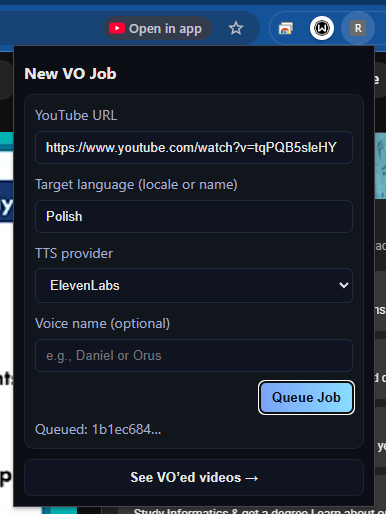
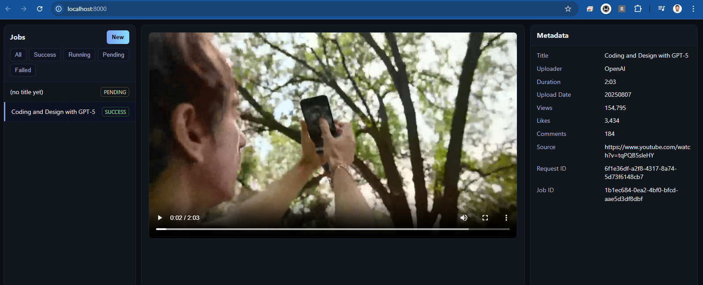

# Renarrate

This is a GenAI powered pipeline for automatically narrating YouTube video voice-overs.
How it works once installed:

- click the extension
- input youtube video link (or autopopulates if you click it on YT video webpage)
- input target voice-over language (or autopopulates using your broswer's locale)
- optionally change provider and input voice (but has default values)
- click `queue job`
- it will be sent to backend for processing and automated generation of voice-over and adding it to video
- click `see VO'ed videos` to see WebUI where you can watch videos with added voice-over
- NOTE: it can take good couple of minutes to finish processing depending on your video, give it 5-15min

---

## **IMPORTANT**

* This is a **very early PoC** — expect bugs.
* Works best for **shorter videos**.
* Running it will incur **API usage costs** (Gemini, ElevenLabs).
* If the WebUI or worker gets stuck:

  ```bash
  curl -X POST http://localhost:8000/admin/clear
  ```

  clears all jobs/storage.
* Only lightly tested during development.
* See `TO_DO` for quick wins — PRs welcome.

---

## **Quick Start**

1. **Clone repo**
2. **Configure `.env`**
   Rename `.env.example` to `.env` and add your API keys:

   * `GEMINI_API_KEY`
   * `ELEVENLABS_API_KEY`
3. **Build & Run**

   ```bash
   docker compose build
   docker compose up -d
   ```
4. **Install Chrome Extension**:

   * Go to `chrome://extensions/`
   * Enable *Developer mode*
   * Click **Load Unpacked**
   * Select the `extension/` directory in this repo
5. **First use**:

   * Click the extension icon in your browser
   * Confirm backend URL (defaults to `http://localhost:8000`)
6. **Queue jobs**:

   * On any YouTube video page, click the extension
   * The video URL and browser locale auto-fill
   * Pick language & voice → submit
     
7. **See VO’ed videos**:
   Click **“See VO’ed videos”** in the extension to open the WebUI
   

---

## **Supported Languages**

These are languages supported by Gemini and all of them are supported by elevenlabs.
You can easily extend this list by adding new langauges to the `./flow/utils/langauges.py` to `LANGUAGES` list in the same format.

| Code  | Display Name           |
| ----- | ---------------------- |
| ar-EG | Arabic (Egyptian)      |
| bn-BD | Bengali (Bangladesh)   |
| nl-NL | Dutch (Netherlands)    |
| en-IN | English (India)        |
| en-US | English (US)           |
| fr-FR | French (France)        |
| de-DE | German (Germany)       |
| hi-IN | Hindi (India)          |
| id-ID | Indonesian (Indonesia) |
| it-IT | Italian (Italy)        |
| ja-JP | Japanese (Japan)       |
| ko-KR | Korean (Korea)         |
| mr-IN | Marathi (India)        |
| pl-PL | Polish (Poland)        |
| pt-BR | Portuguese (Brazil)    |
| ro-RO | Romanian (Romania)     |
| ru-RU | Russian (Russia)       |
| es-US | Spanish (US)           |
| ta-IN | Tamil (India)          |
| te-IN | Telugu (India)         |
| th-TH | Thai (Thailand)        |
| tr-TR | Turkish (Turkey)       |
| uk-UA | Ukrainian (Ukraine)    |
| vi-VN | Vietnamese (Vietnam)   |

---

## **Voice Models**

### **Gemini TTS Voices**

*(Use these in `voice_name` when `tts_provider` is `"gemini"`)*

| Name          | Description                          |
| ------------- | ------------------------------------ |
| Zephyr        | Bright, Higher pitch, Female         |
| Puck          | Upbeat, Middle pitch, Male           |
| Charon        | Informative, Lower pitch, Male       |
| Kore          | Firm, Middle pitch, Female           |
| Fenrir        | Excitable, Lower middle pitch, Male  |
| Leda          | Youthful, Higher pitch, Female       |
| Orus          | Firm, Lower middle pitch, Male       |
| Aoede         | Breezy, Middle pitch, Female         |
| Callirrhoe    | Easy-going, Middle pitch, Female     |
| Autonoe       | Bright, Middle pitch, Female         |
| Enceladus     | Breathy, Lower pitch, Male           |
| Iapetus       | Clear, Lower middle pitch, Male      |
| Umbriel       | Easy-going, Lower middle pitch, Male |
| Algieba       | Smooth, Lower pitch, Male            |
| Despina       | Smooth, Middle pitch, Female         |
| Erinome       | Clear, Middle pitch, Female          |
| Algenib       | Gravelly, Lower pitch, Male          |
| Rasalgethi    | Informative, Middle pitch, Male      |
| Laomedeia     | Upbeat, Higher pitch, Female         |
| Achernar      | Soft, Higher pitch, Female           |
| Alnilam       | Firm, Lower middle pitch, Male       |
| Schedar       | Even, Lower middle pitch, Male       |
| Gacrux        | Mature, Middle pitch, Female         |
| Pulcherrima   | Forward, Middle pitch, Female        |
| Achird        | Friendly, Lower middle pitch, Male   |
| Zubenelgenubi | Casual, Lower middle pitch, Male     |
| Vindemiatrix  | Gentle, Middle pitch, Female         |
| Sadachbia     | Lively, Lower pitch, Male            |
| Sadaltager    | Knowledgeable, Middle pitch, Male    |
| Sulafat       | Warm, Middle pitch, Female           |

---

### **ElevenLabs Voices**

*(Use these in `voice_name` when `tts_provider` is `"elevenlabs"`)*

| Name      | Description                                                                                      |
| --------- | ------------------------------------------------------------------------------------------------ |
| Aria      | A middle-aged female with an African-American accent. Calm with a hint of rasp.                  |
| Sarah     | Young adult woman with a confident and warm, mature quality and a reassuring, professional tone. |
| Laura     | Young adult female delivering sunny enthusiasm with a quirky attitude.                           |
| Charlie   | A young Australian male with a confident and energetic voice.                                    |
| George    | Warm resonance that instantly captivates listeners.                                              |
| Callum    | Deceptively gravelly, yet unsettling edge.                                                       |
| River     | Relaxed, neutral voice ready for narrations or conversational projects.                          |
| Liam      | Young adult with energy and warmth — suitable for reels and shorts.                              |
| Charlotte | Sensual and raspy, perfect for temptress roles in games.                                         |
| Alice     | Clear and engaging, friendly woman with a British accent — great for e-learning.                 |
| Matilda   | Professional woman with a pleasing alto pitch.                                                   |
| Will      | Conversational and laid back.                                                                    |
| Jessica   | Young and playful American female voice for trendy content.                                      |
| Eric      | Smooth tenor pitch from a man in his 40s — ideal for agentic use cases.                          |
| Chris     | Natural and real, down-to-earth.                                                                 |
| Brian     | Middle-aged man with a resonant and comforting tone.                                             |
| Daniel    | Strong voice perfect for delivering professional broadcasts or news stories.                     |
| Lily      | Velvety British female voice — warm and clear for narrations.                                    |
| Bill      | Friendly and comforting storyteller.                                                             |

---
